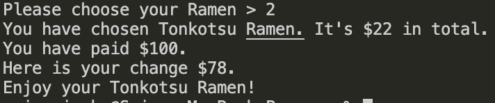

### Provide a link to your source control repository: 
https://github.com/miyakeseigo/SeigoMiyake_T1A3

### *Develop* a statement of *purpose* and *scope* for your application. It must include:
- **describe** at a high level what the application will do
- **identify** the problem it will solve and **explain** why you are developing it
- **identify** the target audience
- **explain** how a member of the target audience will use it

My App is used for the Ramen lovers in Sydney. Ramen here are little bit more expensive than other Ramen shops. However, the ingredients for all Ramen is made from organic and no MSG. The owner of the Sydney Ramen wants to focus on making good ramen but was having an issue when customers visit him,  it was taking lots of his time handling the customers payments by stopping his hands making or serving Ramen to his customers.<br>
He was looking for the web developer who can develop Ramen order system to automate the payment handling so that customer can choose any ramens they want from the application, order it and pay it from an app. This saves lots of time for owner as well as customers. Currently we are encountering the COVID-19 condition and people wants to eat out but do not want to put them on the risk of touching the menu, credit card, cash or some other electronic devices that have been touched by many people.  

### *Develop* a list of *features* that will be included in the application. It must include:
- at least THREE **features**
- **describe** each feature

**Note: Ensure** that your features above allow you to demonstrate your understanding of the following language elements and concepts:
- use of variables and the concept of variable scope
- loops and conditional control structures
- error handling

##### Feature 1: Greetings and Display of Menu
When the aplication is implemented, it shows the welcome message and the list of ramen to choose from 1~5. 
##### Feature 2: User can choose which ramen they would like to have
When user chooses ramen itmes from 1~5, the data (ramen and price) are extracted from the csv file and imported to ruby file.
##### Feature 3: Display the result
It will show which ramen is chosen with the price, how much is paid, how much change is and finaly displays to user "Enjyoy for your (chosen ramen)".

The error handling is done by using the debagging tool gem called ```pry 0.10.3```.  
 
### *Develop* an *outline* of the user interaction and experience for the application.
Your outline must include:
- how the user will find out how to interact with / use each feature
- how the user will interact with / use each feature
- how errors will be handled by the application and displayed to the user

This terminal app is allow user to choose from the list of Ramen from the menu. At the moment, it has only 5 choices but it is easy to add another ramens to the list as the CSV file is used to store the type of Ramens and prices. It can be written by Iterator and Hash method but it will be harder to add to the code later.<br>

Then when the user choose the Ramen from the list, It shows you ;
- “What Ramen you have chosen”
- “How much the Ramen is”
- “How much you have paid”
- “How much your change is”<br>

How much you have paid is currently set up for $100 as default but it can be changed to any amount, and it can also be improved for user to input how much to pay.<br>

This app does not have the feature to show the invalid message when user chooses the Ramen that is not in the list. This feature can be improved in the future and it returns to the list of menu. <br>




### *Develop* a diagram which describes the control flow of your application. Your diagram must:
- show the workflow/logic and/or integration of the features in your application for each feature.
- utilise a recognised format or set of conventions for a control flow diagram, such as UML.


### Develop an implementation plan which:
- **outlines** how each feature will be implemented and a checklist of tasks for each feature
- prioritise the implementation of different features, or checklist items within a feature
- provide a deadline, duration or other time indicator for each feature or checklist/checklist-item

Utilise a suitable project management platform to track this implementation plan

Your checklists for each feature should have at least 5 items.

##### Feature 1 checklist:
- Create flowchart to plan layout and necessary requirements
- Create variables for data input such as items and choices etc.
- Use Gem colorize to add colour to the text.
- Add Gem Pry for debagging tool.
- Add introduction greeting and completion text
- Create Command line argument

##### Feature 2 checklist:
- Create "Item" class, importing ramen datas from csv
- Create "Shop" class, putting the shop products to the shop
- Create "User" class, reflect on the user's action e.g. which ramen is chosen, etc.
- Use Gem Pry for debagging and all works fine.
- Make sure when user chooses the number, it shows the correct information.

##### Feature 3 checklist:
- Display which ramen is chosen.
- Display how much the ramen is.
- Display how much is paid by customer.
- Display how much change the user receive.
- Make sure to display "Enjoy your (chosen ramen)", the chosen ramen is showing and it ends when this message is shown.


##### Trello
The following images are screenshots from Trello that has assisted me in the development plan of this app. Deadlines were created within Trello to enure the planning process and completion of each task was done within the right timeframe.

**Trello update day 1:**

**Trello update day 2:**

**Trello update day 3:**


### *Design* help documentation which includes a set of instructions which accurately describe how to use and install the application.

You must include:
#### steps to install the application
1. You will need ruby installed on your computer. [Download ruby here](https://www.ruby-lang.org/en/).
2. You will also need the Bundler gem installed. It comes with the main ruby installation, but if you do not have it on your machine, you can install it with the following command:

```gem install bundler```

3. Fork or clone this repository down to your local computer.
4. To install the gem(s) required, navigate to the location of the /src folder in repostitory on your computer, and use the command:

```bundle install```

5. Run the app with:

```ruby index.rb```

#### any dependencies required by the application to operate
- If there is no ```pry```installed, implement ```gem install pry``` or delete ```require "pry"``` in ```index.rb```.
- Implement ```gem install colorize```, if there is no ```colorize```gem is intalled.


#### any system/hardware requirements
Ruby 2.7.2
